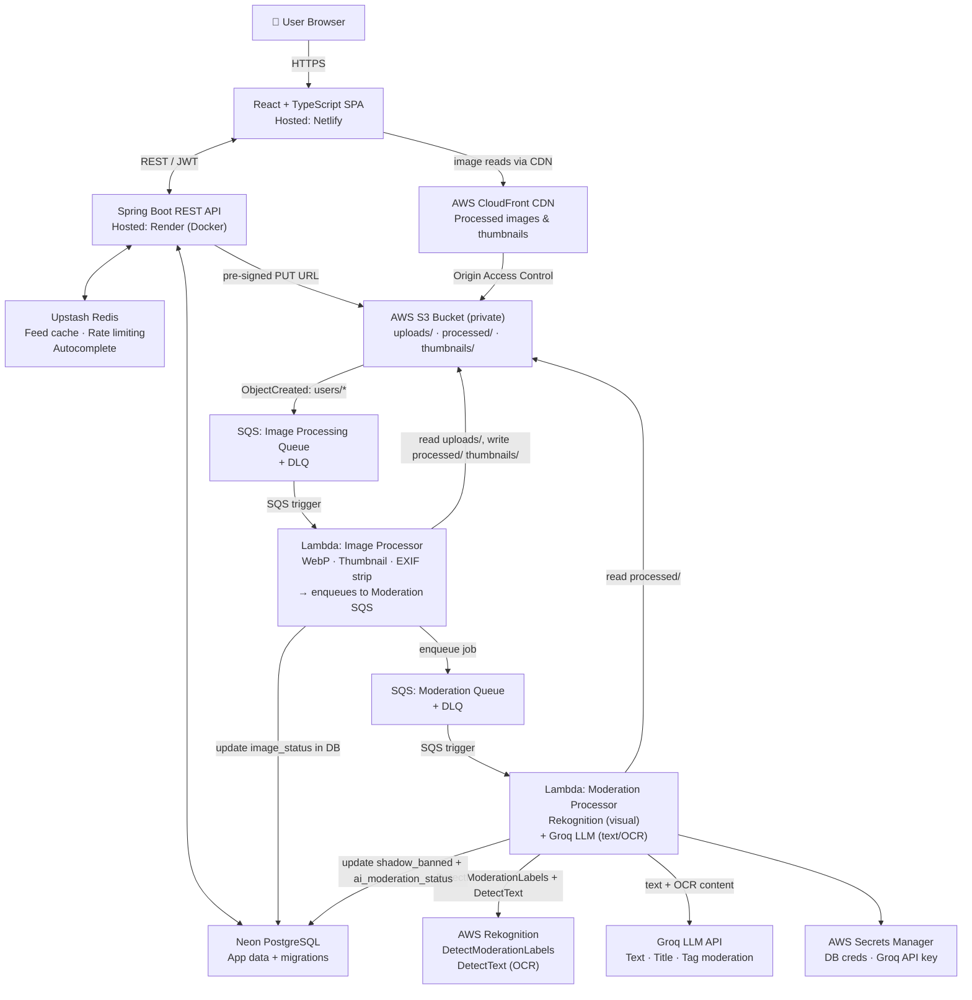

<div align="center">

# 🎲 Caption Roulette

**A social photo app where you post the image — and everyone else writes the words.**

**[Live Demo → captionroulette.netlify.app](https://captionroulette.netlify.app)**

</div>

---

## What is Caption Roulette?

Caption Roulette flips the usual social media formula: **you can post a photo, but you can't caption it yourself.** Other users submit captions, everyone votes on them publicly, and after a 48-hour window the post "settles" — either because you picked your favourite caption, or because the highest-voted one wins automatically.

Every post has two phases:

| Phase | What happens |
|---|---|
| `OPEN` | Anyone can submit one caption · Everyone votes · Poster can pick a winner early |
| `SETTLED` | Winning caption is locked permanently · Post moves to the public showcase feed |

It's part social game, part creative challenge — and an excuse to build a production-grade image processing and AI moderation pipeline.

---

## Features

- **Time-locked caption contests** — posts auto-resolve at 48 hours via lazy settlement evaluation (no fragile cron job)
- **Reddit-style voting** — upvote, downvote, or remove your vote; net score drives caption rankings
- **Async image processing pipeline** — uploads trigger S3 → SQS → Lambda; images are auto-converted to WebP, thumbnails generated, EXIF data stripped
- **AI moderation pipeline** — processed images are enqueued into a separate SQS moderation queue; a dedicated Lambda runs dual-layer checks: AWS Rekognition `DetectModerationLabels` for visual content (nudity, violence, weapons, drugs) + Rekognition `DetectText` (OCR) to extract any text embedded in the image; all extracted text, post title, and tags are then passed to the Groq LLM for classification (profanity, hate speech, harassment, coded language); flagged posts are automatically shadow-banned
- **CloudFront CDN delivery** — processed images served from edge locations, not raw S3
- **Tag system + search** — tag your posts, search by tag or username with Redis-cached autocomplete
- **Redis-backed caching and rate limiting** — feed caching, tag autocomplete caching, per-user rate limits on caption/vote endpoints
- **In-app notifications** — get notified when your caption wins
- **User profiles** — public profiles with post history, editable bio and avatar
- **Moderation** — report posts/captions; admin panel to review reports, delete content, ban users
- **AI caption suggestions** — request AI-generated caption ideas for any open post (Groq)
- **Infrastructure as Code** — all AWS resources managed via AWS CDK across three separate stacks (Storage, Image Processing, Moderation)

---

## Architecture



**Key design decisions worth noting:**

- **Direct-to-S3 uploads** via pre-signed PUT URLs — the Spring Boot server never handles raw image bytes
- **Lazy settlement** — post resolution is evaluated on-read, not by a scheduled job, making it resilient to Render free-tier cold starts
- **Processing fallback** — while an image is processing (`PENDING`), the API automatically serves the original upload; once `DONE`, it returns the CloudFront CDN URL. The frontend never needs to know the difference
- **Dual-layer AI moderation** — the moderation Lambda runs independently of image processing via its own SQS queue and DLQ. Rekognition catches visual violations; Groq LLM (with Rekognition OCR text fed in) catches text-based violations in titles, tags, and embedded image text
- **Shadow-banning** — flagged posts are not deleted but marked `shadow_banned = true` and removed from public feeds; admins can review in the admin panel
- **Dead Letter Queues** — failed Lambda invocations on both pipelines are captured in DLQs for inspection via CloudWatch, not silently dropped
- **AWS CDK (3 stacks)** — all AWS infrastructure is split across `StorageStack`, `ImageProcessingStack`, and `ModerationStack`, each deployable independently with `cdk deploy`

---

## Tech Stack

| Layer | Technology |
|---|---|
| Frontend | React 18 + TypeScript, Vite, Tailwind CSS, TanStack Query |
| Backend | Spring Boot 3, Java 17, Spring Security + JWT, Spring Data JPA |
| Database | PostgreSQL via Neon (serverless), Flyway migrations |
| Object Storage | AWS S3 (private bucket, pre-signed URLs) |
| CDN | AWS CloudFront with Origin Access Control |
| Image Processing | AWS Lambda + SQS (WebP conversion, thumbnails, EXIF stripping) |
| AI Moderation | AWS Lambda + SQS + AWS Rekognition + Groq LLM |
| Infrastructure | AWS CDK (TypeScript) — 3 stacks: Storage, Image Processing, Moderation |
| Cache / Rate Limit | Upstash Redis (REST-based, serverless-friendly) |
| Secrets | AWS Secrets Manager (DB credentials, Groq API key) |
| Hosting | Render (backend Docker), Netlify (frontend static) |
| CI/CD | GitHub Actions |

---

## Getting Started

### Prerequisites

- Java 17+
- Node.js 18+
- Maven 3.9+
- An AWS account (free tier is enough)
- Accounts on: [Neon](https://neon.tech), [Upstash](https://upstash.com), [Render](https://render.com), [Netlify](https://netlify.com)

### 1. Clone the repo

```bash
git clone https://github.com/your-username/caption-roulette.git
cd caption-roulette
```

### 2. Deploy AWS infrastructure (CDK)

```bash
cd aws-infra
npm install
npx cdk bootstrap   # only needed once per AWS account/region
npx cdk deploy --all
```

This deploys three stacks in dependency order: **StorageStack** → **ModerationStack** → **ImageProcessingStack**.

Note the outputs: **S3 bucket name**, **CloudFront distribution domain**, **Image Processing SQS queue URL**, **Moderation SQS queue URL**.

### 3. Configure backend environment

Create `backend/src/main/resources/application-local.yml` (never commit this):

```yaml
spring:
  datasource:
    url: jdbc:postgresql://<neon-host>/<dbname>?sslmode=require
    username: <neon-user>
    password: <neon-password>

aws:
  s3:
    bucket-name: <your-s3-bucket>
    region: us-east-1
    access-key: <iam-access-key>
    secret-key: <iam-secret-key>
  cloudfront:
    domain: <xxxx.cloudfront.net>
  sqs:
    queue-url: <your-image-processing-sqs-queue-url>
    moderation-queue-url: <your-moderation-sqs-queue-url>

jwt:
  secret: <min-32-char-random-string>
  expiry-hours: 24

upstash:
  redis:
    url: <upstash-rest-url>
    token: <upstash-rest-token>

groq:
  api-key: <groq-api-key>   # used by the backend for AI caption suggestions
```

> **Note:** The moderation Lambda retrieves its DB and Groq credentials from **AWS Secrets Manager** (secrets named `postgres-credentials` and `groq-api-key`), not from backend environment variables.

### 4. Run the backend

```bash
cd backend
mvn spring-boot:run -Dspring-boot.run.profiles=local
```

API will be available at `http://localhost:8080`. Health check: `http://localhost:8080/actuator/health`

### 5. Configure and run the frontend

```bash
cd frontend
cp .env.example .env.local
```

Edit `.env.local`:

```env
VITE_API_BASE_URL=http://localhost:8080
```

```bash
npm install
npm run dev
```

Frontend runs at `http://localhost:5173`.

---

## Environment Variables Reference

### Backend (Render env vars for production)

| Variable | Description |
|---|---|
| `DATABASE_URL` | Neon PostgreSQL connection string |
| `AWS_S3_BUCKET_NAME` | S3 bucket name |
| `AWS_REGION` | AWS region (e.g. `us-east-1`) |
| `AWS_ACCESS_KEY_ID` | IAM access key (S3 + SQS permissions) |
| `AWS_SECRET_ACCESS_KEY` | IAM secret key |
| `AWS_CLOUDFRONT_DOMAIN` | CloudFront distribution domain |
| `AWS_SQS_QUEUE_URL` | SQS queue URL for image processing jobs |
| `AWS_SQS_MODERATION_QUEUE_URL` | SQS queue URL for AI moderation jobs |
| `JWT_SECRET` | Random string, min 32 characters |
| `JWT_EXPIRY_HOURS` | Token expiry in hours (default: `24`) |
| `UPSTASH_REDIS_URL` | Upstash REST URL |
| `UPSTASH_REDIS_TOKEN` | Upstash REST token |
| `GROQ_API_KEY` | Groq API key (for AI caption suggestions endpoint) |
| `CORS_ALLOWED_ORIGIN` | Your Netlify frontend URL |

### Frontend (Netlify env vars for production)

| Variable | Description |
|---|---|
| `VITE_API_BASE_URL` | Render backend URL (e.g. `https://your-api.onrender.com`) |

### Lambda (via AWS Secrets Manager)

The moderation Lambda reads secrets directly from AWS Secrets Manager at runtime — no Lambda environment variables needed for credentials:

| Secret Name | Key | Description |
|---|---|---|
| `postgres-credentials` | `DATABASE_URL` | Neon PostgreSQL connection string |
| `groq-api-key` | `GROQ_API_KEY` | Groq API key for LLM text moderation |

---

## AI Moderation Pipeline

When a post is uploaded and the image processor Lambda completes, it enqueues a moderation job to a dedicated SQS queue. The moderation Lambda then runs a **two-phase check**:

### Phase 1 — Visual Moderation (AWS Rekognition)

- Downloads the processed WebP image from S3 and converts it to JPEG (Rekognition requirement)
- Calls `DetectModerationLabels` with per-category confidence thresholds:

| Category | Threshold |
|---|---|
| Explicit Nudity | 75% |
| Violence | 75% |
| Visually Disturbing | 75% |
| Weapons | 80% |
| Drugs | 80% |
| Suggestive | 85% |

### Phase 2 — Text & OCR Moderation (Rekognition + Groq LLM)

- Calls `DetectText` (Rekognition OCR) to extract any text embedded in the image
- Sends the post **title**, **tags**, and **OCR-extracted image text** to the Groq LLM for classification
- The LLM checks for: profanity/slang, sexual content, hate speech, harassment/threats, violence, illegal activity, and coded/dog-whistle language

### Decision

If either phase flags the content, the post is **shadow-banned** (`shadow_banned = true`) and its `ai_moderation_status` is set to `FLAGGED`. Clean posts are marked `SAFE`. Admins can review flagged content in the admin panel and take further action.

Failed moderation jobs are retried up to 3 times before landing in the Moderation DLQ for manual inspection via CloudWatch.

---

## Running Tests

### Backend

```bash
cd backend
mvn test
```

Runs unit tests (service logic, settlement, voting, image URL resolution) and MockMvc controller integration tests. Uses H2 in-memory database — no external DB needed for tests.

### Frontend

```bash
cd frontend
npm run test
```

Runs Vitest component tests with React Testing Library. API layer is mocked via MSW (Mock Service Worker).

### CDK (synth validation only)

```bash
cd aws-infra
npx cdk synth
```

Synthesizes CloudFormation templates to validate CDK code without deploying anything.

---

## Project Structure

```
caption-roulette/
├── backend/                  # Spring Boot API
│   ├── src/main/java/
│   │   └── org/shagnik/backend/
│   │       ├── controller/   # REST controllers (Auth, Post, Caption, Vote, User, Tag, Image, Report, Notification, Search)
│   │       ├── service/      # Business logic (Post, Caption, Vote, Settlement, User, Auth, Notification, Report, Redis, Search, Storage, RateLimit)
│   │       ├── entity/       # JPA entities
│   │       ├── dto/          # Request/response DTOs
│   │       ├── repository/   # Spring Data JPA repositories
│   │       ├── security/     # JWT filter, Spring Security config
│   │       ├── config/       # App configuration beans
│   │       ├── exception/    # Global exception handling
│   │       └── util/         # Utilities
│   └── src/main/resources/
│       └── db/migration/     # Flyway SQL migrations (V1__init.sql etc.)
│
├── frontend/                 # React + TypeScript SPA
│   └── src/
│       ├── components/       # Reusable UI components (auth, layout, posts, captions, etc.)
│       ├── pages/            # Feed, Post Detail, Search, Profile, Admin, Auth
│       ├── hooks/            # Custom React Query hooks
│       ├── api/              # Axios API client
│       └── types/            # TypeScript type definitions
│
└── aws-infra/                # AWS CDK project (TypeScript)
    ├── lib/
    │   ├── storage-stack.ts           # S3 bucket + CloudFront distribution
    │   ├── image-processing-stack.ts  # SQS, DLQ, Lambda (WebP/thumbnail/EXIF)
    │   └── moderation-stack.ts        # SQS, DLQ, Lambda (Rekognition + Groq LLM)
    └── lambda/
        ├── image-processor/           # Node.js Lambda: image conversion pipeline
        └── moderation/                # Node.js Lambda: AI moderation pipeline
```

---

## API Overview

| Method | Endpoint | Description |
|---|---|---|
| `POST` | `/api/auth/register` | Create account |
| `POST` | `/api/auth/login` | Returns JWT |
| `GET` | `/api/users/{username}` | Public user profile |
| `GET` | `/api/users/{username}/posts` | User's posts (paginated) |
| `PUT` | `/api/users/me` | Update own profile (bio, avatar) |
| `POST` | `/api/images/presign` | Get pre-signed S3 upload URL |
| `POST` | `/api/posts` | Create a post |
| `GET` | `/api/posts/open` | Open posts feed (paginated) |
| `GET` | `/api/posts/settled` | Settled posts feed (paginated) |
| `GET` | `/api/posts/{id}` | Post detail |
| `POST` | `/api/posts/{id}/select-winner` | Poster picks winning caption |
| `POST` | `/api/posts/{id}/suggest-captions` | AI caption suggestions (Groq) |
| `POST` | `/api/posts/{postId}/captions` | Submit a caption |
| `GET` | `/api/posts/{postId}/captions` | List captions (`?sort=top\|new\|old`) |
| `POST` | `/api/captions/{id}/vote` | Cast or change a vote (`{value: 1, -1, 0}`) |
| `GET` | `/api/tags/search` | Tag autocomplete (`?q=`) |
| `GET` | `/api/posts/search` | Search by tag or username |
| `GET` | `/api/notifications` | Current user's notifications |
| `POST` | `/api/posts/{id}/report` | Report a post |
| `POST` | `/api/captions/{id}/report` | Report a caption |

All write endpoints require a `Bearer <token>` Authorization header.

---

## Known Limitations

**Backend cold starts** — The Render free tier spins down the backend after 15 minutes of inactivity. The first request after idle will take 40–60 seconds. This is expected behaviour on the free tier and not a bug. Subsequent requests are fast.

**AWS free tier window** — S3, CloudFront, SQS, Lambda, and Rekognition free tiers are valid for 12 months from AWS account creation. At portfolio-demo traffic levels, charges after the free tier window expire are fractions of a cent, but a $1 AWS Budget alert is recommended as a safety net.

**Image processing delay** — After uploading a photo, the Lambda pipeline typically takes 5–15 seconds to complete. During this window, the original (unoptimised) image is served as a fallback. The page does not automatically refresh when processing completes — reload to see the final WebP version.

**Moderation delay** — AI moderation runs after image processing completes and typically adds another 5–15 seconds. Posts are publicly visible during this window; shadow-banning is applied asynchronously once the moderation Lambda completes.

**No email notifications** — Caption-win notifications are in-app only. Check your notification bell after your post settles.

**Single region** — All AWS resources are deployed to `us-east-1`. CloudFront provides global CDN caching for image delivery regardless.

---

## Deployment

| Component | Platform | How |
|---|---|---|
| Frontend | Netlify | Auto-deploys from GitHub `main` branch |
| Backend | Render | Auto-deploys from GitHub `main` branch (Docker) |
| AWS infra | AWS CDK | `cdk deploy --all` from local machine on infrastructure changes |
| Database | Neon | Managed — no deployment steps |
| Cache | Upstash | Managed — no deployment steps |

---

## Contributing

This is a portfolio project but issues and PRs are welcome. If you find a bug or have a suggestion, open an issue and describe it clearly.

---

## License

MIT — see [LICENSE](./LICENSE) for details.

---

<div align="center">
  Built with ☕ Java, too many AWS free-tier services, and a sprinkle of AI.
</div>